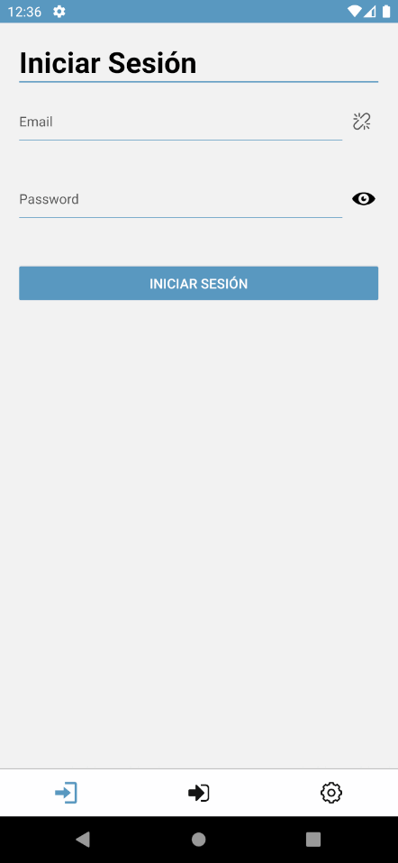

# libraryBlue

  

#### Es una aplicación movil para la gestión del inventario en una librería/biblioteca. Permite añadir otras librerías/bibliotecas como asociadas para compartir parte del inventario. Además, se implementan diferentes niveles de permisos para diferentes rangos dentro de la organización. La aplicación permite una rápida actualización de los registros de salida de los artículos y dispone de un buscador que permite encontrar artículos según siete etiquetas principales.

# Arrancar de manera local

0. Esta App requiere una API, deberas seguir los pasos del repo <a href="https://github.com/MrBluegru/libraryBlue-api">libraryBlue-api</a>. 

1. Descargar el repo como zip.

2. Instalar las dependencias, ejecuta el comando `npm install`.

3. Renombra el archivo `.env.template` a `.env`  y completa los valores.

4. Ejecutar el comando `npm start`.

> Puedes usar un emulador mobile o  descargar la app **Expo Go** en tu dispositivo movil y  escanear el codigo QR que se te mostrara por consola al completar el paso 4.

## Construido con

- Expo
- React Native
- React Navigation
- React Redux
- Redux Toolkit
